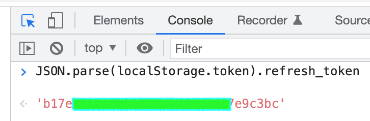

## 阿里云盘每日签到

> 基于 Node.js 实现的阿里云盘每日签到

### TODO

- [x] 阿里云盘签到
- [x] 青龙面板支持
- [ ] 本地运行
- [ ] ~~github action 支持~~

### Use 使用

#### 第一步：获取 refresh_token 并复制

- 自动获取: 登录[阿里云盘](https://www.aliyundrive.com/drive/)后，控制台粘贴
```javascript
copy(JSON.parse(localStorage.token).refresh_token); console.log(JSON.parse(localStorage.token).refresh_token);
```
`
  

- 手动获取: 登录[阿里云盘](https://www.aliyundrive.com/drive/)后，可以在开发者工具 ->
  Application -> Local Storage 中的 `token` 字段中找到。  
  注意：不是复制整段 JSON 值，而是 JSON 里 `refresh_token` 字段的值，如下图所示红色部分：
  

#### 第二步：青龙面板添加依赖项

- axios

#### 第三步：添加环境变量

> `CLIENT_ID` 需添加 `环境变量` 权限

| 参数          | 说明                                             |
| ------------- | ------------------------------------------------ |
| refreshToken  | 阿里云盘 refresh_token, 添加多个可支持多账户签到 |
| CLIENT_ID     | 可选项, 用于青龙面板 API 更新 refreshToken 字段  |
| CLIENT_SECRET | 可选项, 用于青龙面板 API 更新 refreshToken 字段  |
| QL_PATH       | 可选项, 青龙面板path                            |

`CLIENT_ID` 和 `CLIENT_SECRET` 可在 `青龙面板 -> 系统设置 -> 应用设置 -> 新建应用` 新增, 用于自动更新环境变量内 `refreshToken` 配置

#### 第四步：添加订阅

> 添加订阅后可在定时任务列表发现新增任务, 可自行调整任务执行时间
```shell
ql repo https://github.com/mrabit/aliyundriveDailyCheck.git "autoSignin" "" "qlApi"
```

##### 新版本:

`青龙面板 -> 订阅管理 -> 新建订阅`, 在名称输入框粘贴命令并执行

##### 旧版本:

`青龙面板 -> 定时任务 -> 新建任务` 添加命令并执行


### 申明

- 本项目仅做学习交流, 禁止用于各种非法途径
- 项目中的所有内容均源于互联网, 仅限于小范围内学习参考, 如有侵权请第一时间联系 [本项目作者](https://github.com/mrabit) 进行删除

### 鸣谢

#### 特别感谢以下作者及所开发的程序，本项目参考过以下几位开发者代码及思想。

- @Anonym-w: [Anonym-w/autoSigninAliyun](https://github.com/Anonym-w/autoSigninAliyun)
- @ImYrS: [ImYrS/aliyun-auto-signin](https://github.com/ImYrS/aliyun-auto-signin)
