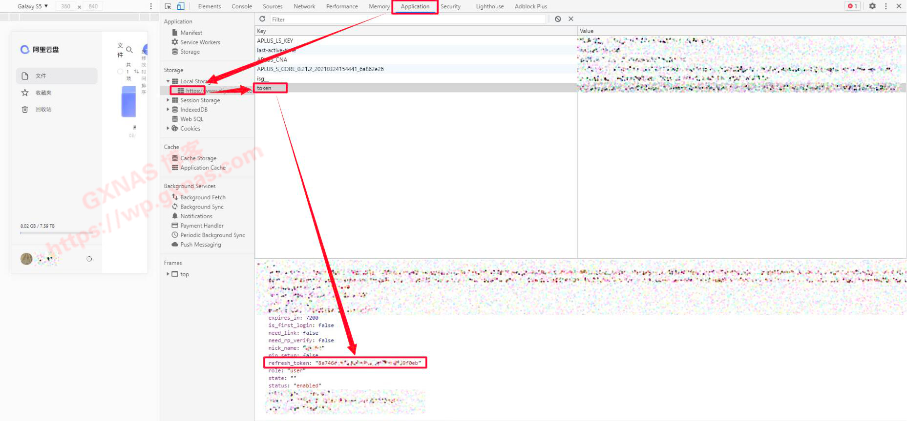

# autoSigninAliyun

阿里云盘的自动签到脚本，青龙，js

# 第一步：获取 refresh_token

1. 网页登录阿里云盘官网 https://www.aliyundrive.com/drive
2. 按 F12，进入开发者工具模式，在顶上菜单栏点 Application ，然后在左边菜单找到 Local storage 下面的 https://www.aliyundrive.com 这个域名，点到这个域名会看到有一个 token 选项，再点 token ，就找到 refresh_token 了
   

# 第二步：添加依赖项

- node-fetch@2
- axios

# 第三步：添加环境变量

- refreshToken: 阿里云盘 refresh_token, 添加多个可支持多账户签到
- CLIENT_ID: 可选, 用于青龙面板 API
- CLIENT_SECRET: 可选, 用于青龙面板 API

`CLIENT_ID` 和 `CLIENT_SECRET` 可在 `青龙面板 -> 系统设置 -> 应用设置 -> 新建应用` 新增, 用于自动更新环境变量内 `refreshToken` 配置

# 第四步：青龙里创建自动任务

```shell
ql repo https://github.com/Anonym-w/autoSigninAliyun.git "autoSignin" "" "qlApi"
```

可自行调整任务执行时间
